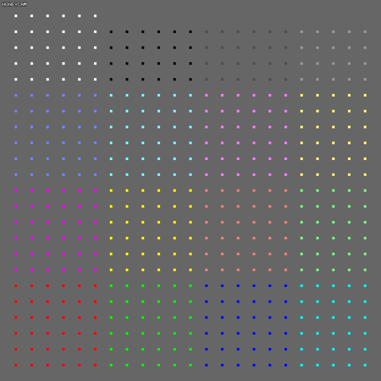

# CSC367 Project Visualizer
DEMO  
* Open https://bit.ly/33lUNJl  
* Download https://bit.ly/2QhRgX0 and copy-paste contents into text area (warning, large text file)

  

Simple renderer for the csc367 project particle output, useful for correctness visualization  
NOTE: Can likely only handle output of around 500 particles without crashing or hanging for a long time depending on your machine

# Generating Output
Configure your mpi processes to each output a file (e.g. sim_0.txt, sim_1.txt...) with the format

```
numparticles,size,numsteps
step,rank,x,y
step,rank,x,y
step,rank,x,y
step,rank,x,y
step,rank,x,y
etc..
```

* Particle order does not matter since the step is in the format  
* You don't have to print every step, I found every other step looks good  

I did it like this
```c++
#include <string.h>
#include <sstream>

std::ostringstream oss;
oss << "sim_" << rank << ".txt";
FILE *fsave_custom = fopen( oss.str().c_str(), "w" );
bool first = true;

// In the step loop
if( find_option( argc, argv, "-no" ) == -1 ) {
    if( fsave_custom && (step%2) == 0 ) {
        // Metadata     
        if(first) {
            float size = 0.0005*n; // Copied from common
            fprintf(fsave_custom, "%d,%g,%d\n", n, size,NSTEPS);
            first = false;
        }

        // For each particle p owned by rank 
        {
            fprintf(fsave_custom, "%d,%d,%g,%g\n", step, rank, p.x, p.y);
        }
    }
}
```

# Combine Output
Combine all the output into one file, I did it with the script  
```bash
# combine.sh
first=1
for var in "$@"; do 
    if [ $first -eq 1 ]; then
        cat $var > './simdata.txt'
        first=0
    else
        cat $var | tail -n +2 >> './simdata.txt'
    fi
done
```
and running it like `./combine.sh ./sim_*.txt`  

You can look in the sampleoutput folder for examples  

# Running Visualization
* Open Visualization.html  
* Paste lines of simdata.txt into the simulation  
* Wait a minute for program to parse  
* NOTE AGAIN: Don't do more than 500 particles otherwise it will will likely crash webgl.  

# Source
Feel free to edit the source, you can compile it into a single html with the `./compile.sh` script